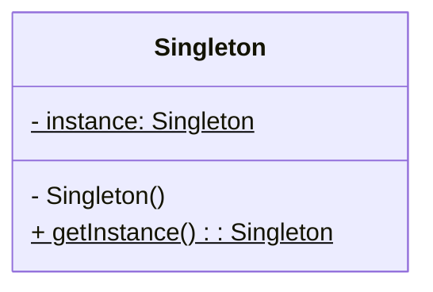
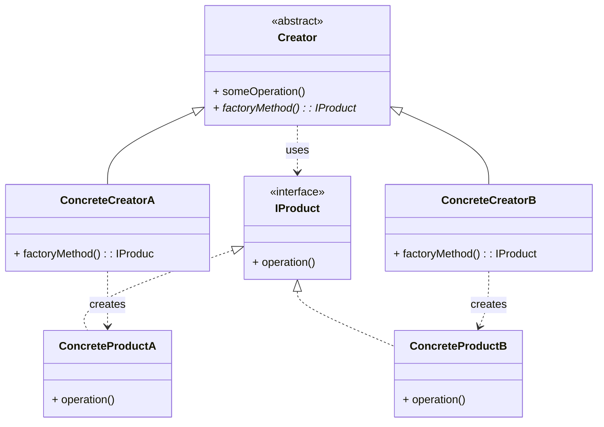
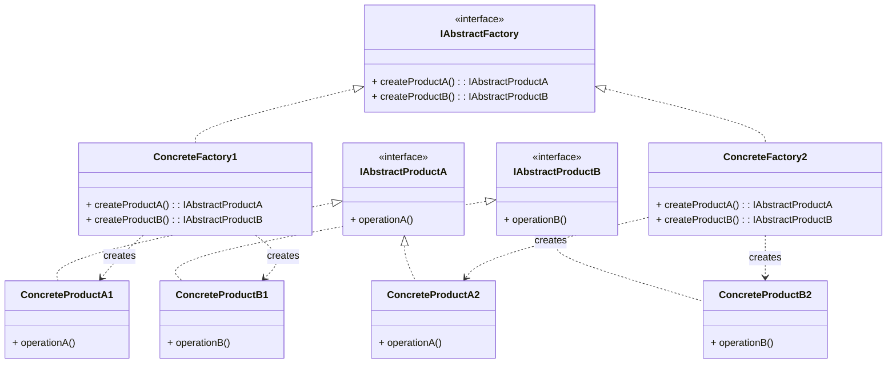
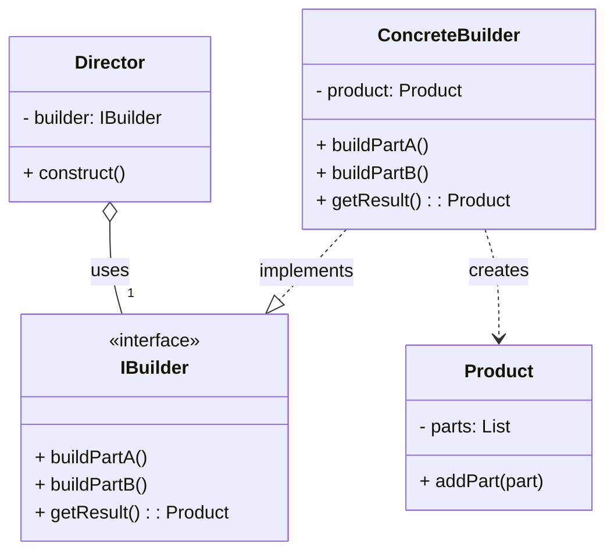
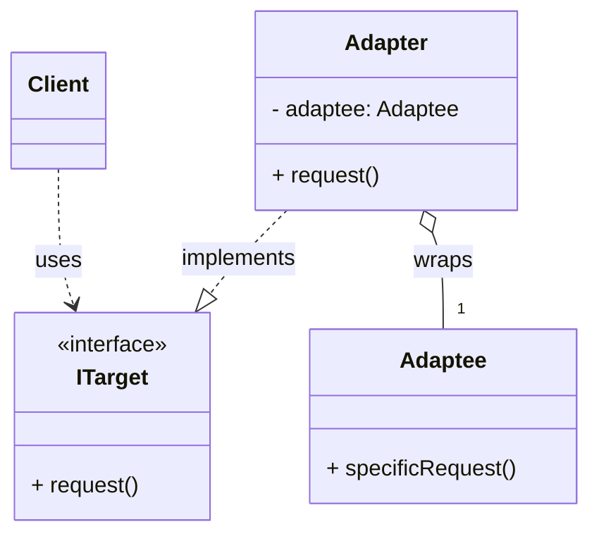
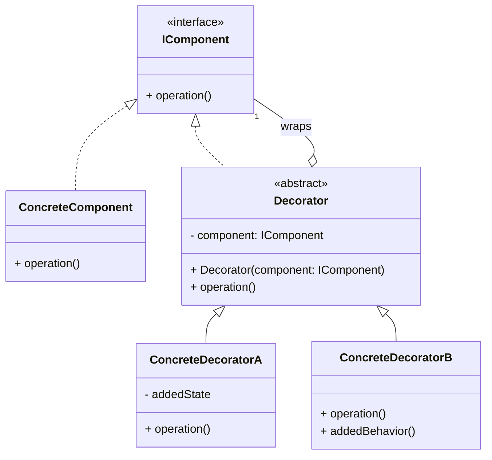
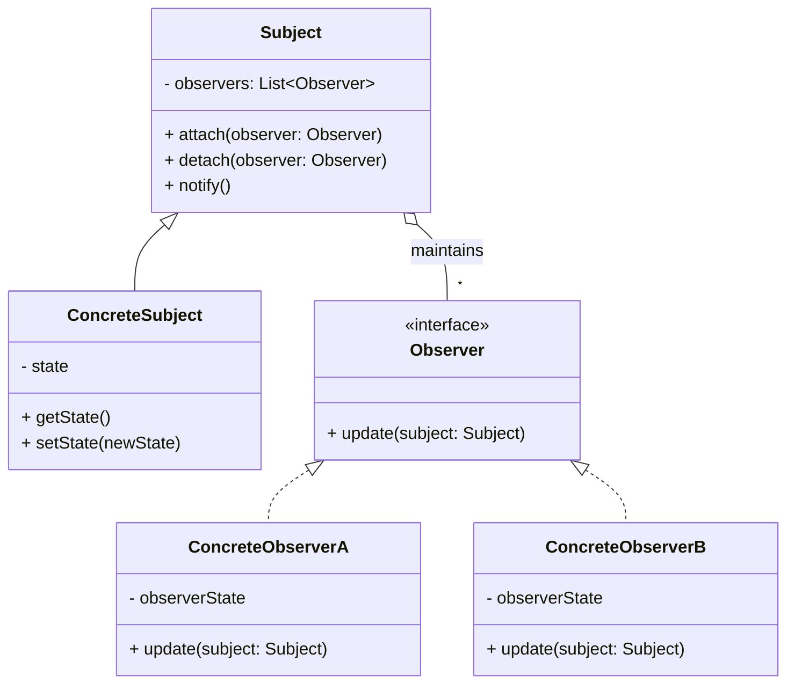
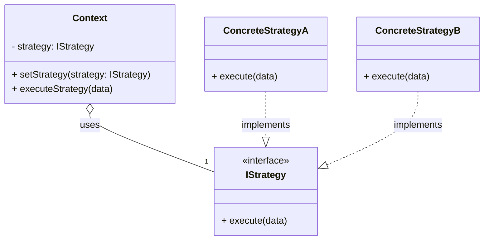
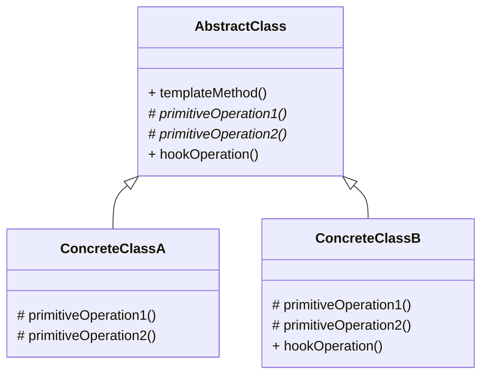

# Diagramas de Patrones de Diseño

## 1\. Patrones Creacionales

### Singleton

Este diagrama muestra la estructura del patrón de diseño Singleton, que garantiza que una clase solo tenga una única instancia y proporciona un punto de acceso global a ella.

Explicación de los Componentes

- **Singleton:** Es la clase que implementa el patrón.

- **\- instance: Singleton$:** Es el atributo estático ($) y privado (-) que almacena la única instancia de la clase.

- **\- Singleton():** El constructor es privado (-) para evitar que se creen instancias de la clase desde fuera con el operador new.

- **+ getInstance(): Singleton$:** Es el método estático ($) y público (+) que devuelve la única instancia de la clase. Se encarga de crear la instancia la primera vez que se llama y de devolverla en las llamadas subsecuentes.

---

### Factory Method

Este diagrama muestra la estructura del patrón de diseño Factory Method. Este patrón define una interfaz para crear un objeto, pero delega en las subclases la decisión de qué clase concreta instanciar.

**Explicación de los Componentes**

- **IProduct (Interfaz de Producto):** Declara la interfaz para los objetos que el método de fábrica (factoryMethod) crea.

- **ConcreteProductA / ConcreteProductB (Productos Concretos):** Son las clases que implementan la interfaz IProduct. Son los objetos que se crearán.

- **Creator (Creador):**

    - Declara el `factoryMethod` que devuelve un objeto de tipo `IProduct`. Este método es abstracto.

    - También puede definir un método (`someOperation`) que utiliza el producto creado por el `factoryMethod`.

- **ConcreteCreatorA / ConcreteCreatorB (Creadores Concretos):**

    - Heredan de `Creator` y sobrescriben el `factoryMethod` para devolver una instancia de un `ConcreteProduct` específico.

Este patrón permite que una clase delegue la responsabilidad de la instanciación a sus subclases, promoviendo un bajo acoplamiento.

---

### Abstract Factory

Este diagrama muestra la estructura del patrón de diseño Abstract Factory. Este patrón proporciona una interfaz para crear familias de objetos relacionados o dependientes sin especificar sus clases concretas.

**Explicación de los Componentes**

- **IAbstractFactory (Fábrica Abstracta):** Declara una interfaz para operaciones que crean productos abstractos.

- **ConcreteFactory1 / ConcreteFactory2 (Fábricas Concretas):** Implementan las operaciones para crear objetos de productos concretos. Cada fábrica corresponde a una familia de productos.

- **IAbstractProductA / IAbstractProductB (Productos Abstractos):** Declaran interfaces para un tipo de objeto de producto.

- **ConcreteProduct (Productos Concretos):** Son las clases que implementan las interfaces de los productos abstractos. Son creados por las fábricas concretas correspondientes.

Este patrón es especialmente útil cuando un sistema debe ser independiente de cómo sus productos son creados, compuestos y representados.

---

### Builder (Constructor)

Este diagrama muestra la estructura del patrón de diseño Builder. Este patrón separa la construcción de un objeto complejo de su representación, de modo que el mismo proceso de construcción pueda crear diferentes representaciones.

### Explicación de los Componentes

-   **Director:** Construye un objeto utilizando la interfaz `IBuilder`. El `Director` no conoce los detalles de la implementación de las partes, solo el orden en que deben ser construidas.
    
-   **IBuilder (Interfaz Builder):** Especifica los métodos para crear las diferentes partes del objeto `Product`.
    
-   **ConcreteBuilder (Builder Concreto):** Implementa la interfaz `IBuilder` para construir y ensamblar las partes del producto. Mantiene un registro de la representación que crea y proporciona un método para recuperar el resultado (`getResult`).
    
-   **Product (Producto):** Representa el objeto complejo que se está construyendo.
    

Este patrón es muy útil cuando la creación de un objeto requiere muchos pasos o configuraciones complejas.

---

## 2\. Patrones Estructurales

### Adapter (Adaptador)

Este diagrama muestra la estructura del patrón de diseño Adapter. Este patrón permite que objetos con interfaces incompatibles colaboren entre sí.

### Explicación de los Componentes

-   **Client (Cliente):** Es la clase que necesita usar un objeto, pero solo puede hacerlo a través de una interfaz específica (`ITarget`).
    
-   **ITarget (Objetivo):** Es la interfaz que el `Client` espera y utiliza.
    
-   **Adaptee (Adaptado):** Es la clase existente que tiene una interfaz incompatible con la que el `Client` espera. Es la clase que necesita ser adaptada.
    
-   **Adapter (Adaptador):** Es la clase que une al `Client` y al `Adaptee`. Implementa la interfaz `ITarget` y, en su interior, contiene una instancia del `Adaptee`. Cuando el `Client` llama al método `request()` en el `Adapter`, este traduce la llamada a un método `specificRequest()` del `Adaptee`.
    

Este patrón actúa como un traductor entre dos interfaces que de otro modo no podrían trabajar juntas.

---

### Decorator (Decorador)

Este diagrama muestra la estructura del patrón de diseño Decorator. Este patrón permite añadir nuevas funcionalidades a un objeto de forma dinámica, envolviéndolo en objetos decoradores que contienen esas funcionalidades

### Explicación de los Componentes

-   **IComponent (Componente):** Define la interfaz para los objetos que pueden tener responsabilidades añadidas dinámicamente.
    
-   **ConcreteComponent (Componente Concreto):** Es la clase del objeto al que se le van a añadir nuevas funcionalidades.
    
-   **Decorator (Decorador):** Mantiene una referencia a un objeto `IComponent` y define una interfaz que se ajusta a la de `IComponent`. Delega el trabajo al componente que envuelve.
    
-   **ConcreteDecoratorA / ConcreteDecoratorB (Decoradores Concretos):** Son las clases que añaden las nuevas responsabilidades al componente. Extienden la funcionalidad del decorador base añadiendo su propio comportamiento antes o después de delegar la tarea al componente envuelto.
    

Este patrón es una alternativa flexible a la herencia para extender la funcionalidad de una clase.

---

## 3\. Patrones de Comportamiento

### Observer (Observador)

Este diagrama muestra la estructura del patrón de diseño Observer, que define una dependencia uno a muchos entre objetos, de modo que cuando un objeto (el sujeto) cambia su estado, todos sus dependientes (los observadores) son notificados y actualizados automáticamente.

**Explicación de los Componentes**

- **Subject (Sujeto):** Conoce a sus observadores. Proporciona una interfaz para agregar (attach) y quitar (detach) observadores.

- **ConcreteSubject (Sujeto Concreto):** Almacena el estado de interés para los observadores. Notifica a sus observadores (notify) cuando su estado cambia.

- **Observer (Observador):** Define una interfaz de actualización para los objetos que deben ser notificados de los cambios en un sujeto.

- **ConcreteObserver (Observador Concreto):** Mantiene una referencia a un objeto ConcreteSubject. Almacena el estado que debe mantenerse consistente con el del sujeto. Implementa la interfaz update para reaccionar a las notificaciones.

---

### Strategy (Estrategia)

**Explicación de los Componentes**

- **Context:** Es la clase que utiliza un objeto Strategy. Mantiene una referencia a una de las estrategias concretas, pero se comunica con ella a través de la interfaz IStrategy.

- **IStrategy (Interfaz):** Define el método común (execute) que todas las estrategias concretas deben implementar. El Context utiliza esta interfaz para llamar al método de la estrategia seleccionada.

- **ConcreteStrategyA / ConcreteStrategyB:** Son las implementaciones específicas del algoritmo. Cada una proporciona una versión diferente del método execute.

---

### Template Method (Método Plantilla)

Este diagrama muestra la estructura del patrón de diseño Template Method. Este patrón define el esqueleto de un algoritmo en una superclase, pero deja que las subclases sobrescriban pasos específicos del algoritmo sin cambiar su estructura.

**Explicación de los Componentes**

- **AbstractClass (Clase Abstracta):**

    - Contiene el `templateMethod()`, que es el método principal que define la secuencia del algoritmo.

    - Llama a operaciones primitivas (`primitiveOperation1`, `primitiveOperation2`) que son abstractas y deben ser implementadas por las subclases.

    - Puede contener "hooks" (`hookOperation`), que son métodos con una implementación por defecto que las subclases pueden sobrescribir opcionalmente.

- **ConcreteClassA / ConcreteClassB (Clases Concretas):**

    - Heredan de `AbstractClass`.

    - Proporcionan la implementación específica para las operaciones primitivas (`#primitiveOperation1`, `#primitiveOperation2`).

    - Pueden sobrescribir los "hooks" para personalizar el algoritmo.